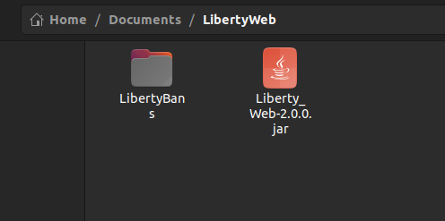

# Liberty Web Docs
Welcome to the LibertyBans Web Interface Documentation.

## Installation Guide
- Download the latest version of Liberty Web [here](https://github.com/Dimitri-Bit/Liberty-Bans-Web/releases)
- Create a new folder in which you will run your Liberty Web server (If you are using a shared hosting panel such as Pterodactyl simply upload the jar to your server)
- Copy your LibertyBans plugin folder and place it in the same directory as your Liberty Web jar (the plugin folder should be configured with the external database connection credentials)

- Start the Liberty Web jar `java -jar Liberty_Web-VERSION.jar`, when you start Liberty Web for the first time a config.yml file will be created which you can then configure. The config looks something like this:

```yaml
server:
  # On what port the server will run
  port: 8080
  host: "0.0.0.0"

# Cache configuration
caffeine:
  # Some usernames aren't saved in the database, so we must retrieve them using Mojang's API
  # The provided configuration should be suitable for most users
  mojang:
    # Maximum amount of usernames to cache
    maxSize: 150
    # After what time cache record will expire
    expiration: "10m"
```

- After you're done editing your config.yml start Liberty Web once again, on the second startup a new folder called frontend will be created. In this folder you can edit or completely change the style of your website to suit your needs. If you wish to create a completely new frontend you should learn some more about the backend on [this guide](endpoints.md).
- You are done, you can now view your punishments online. Please note that this is meant to be a public facing website to allow all your players to publicly view your server's punishments. Some features meant for administration use of the server should be added in future updates so stay tuned.
